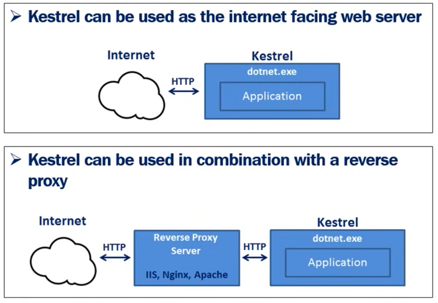

- [Kudvenkat](#kudvenkat)
  - [Topics](#topics)
    - [DOTNET](#dotnet)
      - [Web Server Hosting](#web-server-hosting)
      - [Other](#other)
- [C# Programming Language](#c-programming-language)
  - [C# Tutorial For Beginners](#c-tutorial-for-beginners)
  - [LINQ Tutorials](#linq-tutorials)

---

# Kudvenkat

1. [Creating asp net core web application 🔗](https://www.youtube.com/watch?v=4IgC2Q5-yDE&list=PL6n9fhu94yhVkdrusLaQsfERmL_Jh4XmU)
   1. The course is for NET Core 2.2

## Topics

### DOTNET

#### Web Server Hosting

- InProcess Hosting [🔗](https://youtu.be/ydR2jd3ZaEA?list=PL6n9fhu94yhVkdrusLaQsfERmL_Jh4XmU)
  - `WebApplication.CreateBuilder(args);` - One web server: Kestrel or IIS Express
    - IIS worker process (_w3wp.exe_ or _iisexpress.exe_)
    - No proxy request penalties
- OutOfProcess Hosting (_default_) [🔗](https://youtu.be/QsXsOX6qq2c?list=PL6n9fhu94yhVkdrusLaQsfERmL_Jh4XmU)
  - `dotnet.exe` process
  - Internal server: Kestrel
  - External web server (or _reverse proxy server_): IIS (Express), Nginx or Apache

#### Other

- `IConfiguration` service:
  - `appsettings.json` [🔗](https://youtu.be/m_BevGi7zBw?list=PL6n9fhu94yhVkdrusLaQsfERmL_Jh4XmU)
  - Reading order: `appsettings.json`, `appsettings.{Environment}.json`, User secrets, Environment variables, lastly, CLI arguments.
- Middlewares introduction [🔗](https://youtu.be/ALu4jtvjSYw?list=PL6n9fhu94yhVkdrusLaQsfERmL_Jh4XmU)
  - Pipeline configuration [🔗](https://youtu.be/nt6anXAwfYI?list=PL6n9fhu94yhVkdrusLaQsfERmL_Jh4XmU)
- Static files and default files [🔗](https://youtu.be/yt6bzZoovgM?list=PL6n9fhu94yhVkdrusLaQsfERmL_Jh4XmU)
- Development environments [🔗](https://youtu.be/x8jNX1nb_og?list=PL6n9fhu94yhVkdrusLaQsfERmL_Jh4XmU)
  - _Development_, _Staging_, _Production_
  - `ASPNETCORE_ENVIRONMENT` for selecting the run environment.
- MVC Design [🔗](https://youtu.be/f72ookCWhsQ?list=PL6n9fhu94yhVkdrusLaQsfERmL_Jh4XmU)
  - MVC Model = Model class and class repository
- NET Core MVC project set up (2.2 version) [🔗](https://youtu.be/KQH51Yip0K0?list=PL6n9fhu94yhVkdrusLaQsfERmL_Jh4XmU)
- MVC Implementation:
  - Model [🔗](https://youtu.be/KXPbJ9I4ce0?list=PL6n9fhu94yhVkdrusLaQsfERmL_Jh4XmU)
    - And simple use case for Dependency Injection
  - Controller [🔗](https://youtu.be/-O0UYM0ZIIc?list=PL6n9fhu94yhVkdrusLaQsfERmL_Jh4XmU)
    - Using Telerik Fiddler, receiving XML format
  - View [🔗](https://youtu.be/SWIcHLBnJUg?list=PL6n9fhu94yhVkdrusLaQsfERmL_Jh4XmU)
    - Contains logic to display the Model data
    - Customize view discovery [🔗](https://youtu.be/gXiYrUoiinY?list=PL6n9fhu94yhVkdrusLaQsfERmL_Jh4XmU)
- Dependency Injection [🔗](https://youtu.be/BPGtVpu81ek?list=PL6n9fhu94yhVkdrusLaQsfERmL_Jh4XmU)
  - Benefits: Loose coupling, Easier unit testing
  - Lifetime service registration [🔗](https://youtu.be/v6Nr7Zman_Y?list=PL6n9fhu94yhVkdrusLaQsfERmL_Jh4XmU) [🔗](https://csharp-video-tutorials.blogspot.com/2019/04/addsingleton-vs-addscoped-vs.html) [🖼️](./images/service-registration.png) - Consider: Service instance within current HTTP request.
    - `builder.Services.AddSingleton()` - Creates a single instance of the service when it is first requested, and reuses that same instance in all the places where that service is needed - _3 4 5 6 7... So on and so foth._
    - `builder.Services.AddScoped()` - A new instance of a Scoped service is created once per request within the scope. For example, in a web application it creates 1 instance per each http request but uses the same instance in the other calls within that same web request. - _3 4 4 4 4 4... So on and so foth._
    - `builder.Services.AddTransient()` - A new instance of a Transient service is created each time it is requested. - _3 3 3 3 3... So on and so foth._
- Passing data from controller to view:
  - Looslie typed views:
    - `ViewData` [🔗](https://youtu.be/tz4q6q0_JwQ?list=PL6n9fhu94yhVkdrusLaQsfERmL_Jh4XmU) - Dictionary of weakly typed objects as `ViewData["PageTitle"]`
    - `ViewBag` [🔗](https://youtu.be/FBvNz00o7jg?list=PL6n9fhu94yhVkdrusLaQsfERmL_Jh4XmU) - Use dynamic properties of type `ViewBag.PageTitle`
    - Features:
      - _ViewBag_ is a wrapper to _ViewData_
      - Dynamically resolved at runtime. No type checking at compile time nor intellisense.
  - Strongly typed view [🔗](https://youtu.be/5auO0iXrOs4?list=PL6n9fhu94yhVkdrusLaQsfERmL_Jh4XmU)
  - ViewModels [🔗](https://youtu.be/Lu24lZsUreg?list=PL6n9fhu94yhVkdrusLaQsfERmL_Jh4XmU)
    - We create a ViewModel when a Model object does not contain all the data a view needs.
- Page Views:
  - Layout View [🔗](https://youtu.be/Px8nwoO7FO8?list=PL6n9fhu94yhVkdrusLaQsfERmL_Jh4XmU)
  - ListView [🔗](https://youtu.be/nHAMDUtiV6w?list=PL6n9fhu94yhVkdrusLaQsfERmL_Jh4XmU)
  - Sections in Layout Page [🔗](https://youtu.be/9OyrzRVZT8o?list=PL6n9fhu94yhVkdrusLaQsfERmL_Jh4XmU)
    - For the organization of page elements. They can be optional or mandatory.
  - `_ViewStart.cshtml` [🔗](https://youtu.be/r7WgjrTSlO8?list=PL6n9fhu94yhVkdrusLaQsfERmL_Jh4XmU) - First page to execute.
  - `_ViewImports.cshtml` [🔗](https://youtu.be/5HskoMcun9A?list=PL6n9fhu94yhVkdrusLaQsfERmL_Jh4XmU) - Used to include common namespaces.
    - View directives: `@addTagHelper` `@removeTagHelper` `@tagHelperPrefix` `@model` `@inherits` `@inject`
- Routing:
  - Conventional Routing [🔗](https://youtu.be/ZoxrbrHjj2g?list=PL6n9fhu94yhVkdrusLaQsfERmL_Jh4XmU)
  - Attribute Routing [🔗](https://youtu.be/prNptonJAiY?list=PL6n9fhu94yhVkdrusLaQsfERmL_Jh4XmU) - Applied to the controllers or to the controller actions methods.
    - NOTE: The _controller route template_ is not combined with _action method route template_, if the route template on the action method begins with `/` or `~/`
    - Tokens in attribute routing: `[Route("[controller]/[action]")]`
- Using `libman` [🔗](https://youtu.be/5qzzjvZ4w0c?list=PL6n9fhu94yhVkdrusLaQsfERmL_Jh4XmU)
  - Use LibMan with ASP\.NET Core in Visual Studio [🔗](https://learn.microsoft.com/en-us/aspnet/core/client-side/libman/libman-vs?view=aspnetcore-9.0#add-library-files)
- Tag Helpers:
  - Notes: Similar to _HTML Helpers_. Server side components for HTML rendering. Use: Link generation, form creation, asset load, etc.
  - Tag Helpers & HTML Helpers [🔗](https://youtu.be/iaSdTMdReWg?list=PL6n9fhu94yhVkdrusLaQsfERmL_Jh4XmU)
  - Why use Tag Helpers [🔗](https://youtu.be/pXvizSVe-eQ?list=PL6n9fhu94yhVkdrusLaQsfERmL_Jh4XmU)
  - Image Tag Helper [🔗](https://youtu.be/4jW9T-TLPTM?list=PL6n9fhu94yhVkdrusLaQsfERmL_Jh4XmU) - Provide cache-busting behaviour for static image files.
  - Environment Tag Helper [🔗](https://youtu.be/-E4zP2L-R_U?list=PL6n9fhu94yhVkdrusLaQsfERmL_Jh4XmU)
  - Form Tag Helpers [🔗](https://youtu.be/mU4hV50rkVE?list=PL6n9fhu94yhVkdrusLaQsfERmL_Jh4XmU)
    - `Form Tag Helper`, `Input Tag Helper`, `Label Tag Helper`, `Select Tag Helper`, `TextArea Tag Helper`, `Validation Tag Helper`
- Model Binding [🔗](https://youtu.be/-GkZERrqEQo?list=PL6n9fhu94yhVkdrusLaQsfERmL_Jh4XmU)
  - "Model binding maps data in an HTTP request to controller action method parameters. The action parameters say be simple or complext types."
  - `name` input attribute value is used for mapping.
  - Data available in the HTTP request (with preeminence order): `Form values` → `Route values` → `Query strings`
- **SERVER SIDE VALIDATION**
  - Model Validation [🔗](https://youtu.be/aDRC_IgwmH8?list=PL6n9fhu94yhVkdrusLaQsfERmL_Jh4XmU) - Part ?
  - Custom validation attributes [🔗](https://youtu.be/o_AH2MGti0A?list=PL6n9fhu94yhVkdrusLaQsfERmL_Jh4XmU) - Part 76
  - Select list validation [🔗](https://youtu.be/woFHR3iNEEI?list=PL6n9fhu94yhVkdrusLaQsfERmL_Jh4XmU)
- **BOOTSTRAP**
  - Navigation Menu [🔗](https://youtu.be/l2dzzuxvmxk?list=PL6n9fhu94yhVkdrusLaQsfERmL_Jh4XmU)
- **ENTITY FRAMEWORK CORE** [🔗](https://youtu.be/OE0_9c-K-Ow?list=PL6n9fhu94yhVkdrusLaQsfERmL_Jh4XmU)
  - Notes:
    - ORM, Domain Classes, Code/Database First, Database Provider Models
    - `Domain & DBContext Classes` → `EF Core` → `DB Provider` → `Actual DB`
  - Installation & Multilayer Web Application [🔗](https://youtu.be/8aHzSx-inDE?list=PL6n9fhu94yhVkdrusLaQsfERmL_Jh4XmU)
    - `Presentation Layer` → `Business Layer` → `Data Access Layer`
  - `DbContext` [🔗](https://youtu.be/nN9jOORIFtc?list=PL6n9fhu94yhVkdrusLaQsfERmL_Jh4XmU)
  - Using with SQL Server [🔗](https://youtu.be/xMktEpPmadI?list=PL6n9fhu94yhVkdrusLaQsfERmL_Jh4XmU) - Connection string
  - Repository Pattern [🔗](https://youtu.be/qJmEI2LtXIY?list=PL6n9fhu94yhVkdrusLaQsfERmL_Jh4XmU) - Abstraction of the Data Access Layer, for CRUD operations. How to use `AddScoped` with SQL Server.
  - Migrations [🔗](https://youtu.be/G14lmWS-h4k?list=PL6n9fhu94yhVkdrusLaQsfERmL_Jh4XmU) - Migrations keep the DB schema and app model classes in sync.
    - Commands: `get-help about_entityframeworkcore` `Add-Migration` `Update-Database`
  - Seed Data to Database [🔗]()
  - Keeping _domain models_ and _database schema_ in sync [🔗](https://youtu.be/MhvOKHUWgiY?list=PL6n9fhu94yhVkdrusLaQsfERmL_Jh4XmU) - `Remove-Migration`
    - This video also explains how to remove migration that has already been applied to the database.
- File upoad [🔗](https://youtu.be/aoxEJii70_I?list=PL6n9fhu94yhVkdrusLaQsfERmL_Jh4XmU) - `IFormFile`, the video includes jQuery code for `.custom-file-label`.
  - Notes:
    - File is saved to the web server location `wwwroot/images`
    - The file uploaded to the server can be accessed through Model Binding using the IFormFile interface.
  - Upload multiple files at once [🔗](https://youtu.be/14ZqBoQIW-Q?list=PL6n9fhu94yhVkdrusLaQsfERmL_Jh4XmU)
- Update a model:
  - Edit View - GET [🔗](https://youtu.be/lhiIvx7jMaY?list=PL6n9fhu94yhVkdrusLaQsfERmL_Jh4XmU) - `Edit.cshtml` with controller and viewmodel.
  - Edit View - POST [🔗](https://youtu.be/wamToyK4x7I?list=PL6n9fhu94yhVkdrusLaQsfERmL_Jh4XmU)
- Handling `404` Not Found Errors:
  - Type 1: Resource with ID not found [🔗](https://youtu.be/QiF3eJ4Zb0o?list=PL6n9fhu94yhVkdrusLaQsfERmL_Jh4XmU)
  - Type 2: URL does not match any route.
    - Centralized `404` Error Handling (`400`-`599`):
      - `UseStatusCodePages` [🔗](https://youtu.be/DVo138knAHQ?list=PL6n9fhu94yhVkdrusLaQsfERmL_Jh4XmU)
      - User facing: `UseStatusCodePagesWithRedirects` and `UseStatusCodePagesWithReExecute` [🔗](https://youtu.be/9CwgiSxrkeQ?list=PL6n9fhu94yhVkdrusLaQsfERmL_Jh4XmU)
- Correct Global Exception handling:
  - Not production: `UseExceptionHandler` [🔗](https://youtu.be/jeBttUIqpuc?list=PL6n9fhu94yhVkdrusLaQsfERmL_Jh4XmU)
- Logging:
  - Basics, Logging from console, Built-in Logging Providers [🔗](https://youtu.be/WyAJe6lA-bY?list=PL6n9fhu94yhVkdrusLaQsfERmL_Jh4XmU)
  - Logging Exceptions [🔗](https://youtu.be/LhpO2sgxqfw?list=PL6n9fhu94yhVkdrusLaQsfERmL_Jh4XmU)
  - Logging to a file [🔗](https://youtu.be/o5u4fE0t79k?list=PL6n9fhu94yhVkdrusLaQsfERmL_Jh4XmU)
- **ASP.NET Core Identity** - Authentication & Authorization [🔎](https://www.google.com/search?q=asp+net+core+identity+documentation) [📑](https://learn.microsoft.com/en-us/aspnet/core/security/authentication/identity?view=aspnetcore-8.0&tabs=visual-studio)
  - Inherit from `IdentityDbContext`, add services, add middleware, generate tables [🔗](https://youtu.be/egITMrwMOPU?list=PL6n9fhu94yhVkdrusLaQsfERmL_Jh4XmU)
  - Register new user [🔗](https://youtu.be/sPbDrqpme_w?list=PL6n9fhu94yhVkdrusLaQsfERmL_Jh4XmU)
  - Services: `UserManager` and `SignInManager` [🔗](https://youtu.be/TfarnVqnhX0?list=PL6n9fhu94yhVkdrusLaQsfERmL_Jh4XmU)
  - Password complexity [🔗](https://youtu.be/kC9qrUcy2Js?list=PL6n9fhu94yhVkdrusLaQsfERmL_Jh4XmU)
  - Show/hide view elements using `@if (SignInManager.IsSignedIn(User)) { }` [🔗](https://youtu.be/YLAHIZmO2PI?list=PL6n9fhu94yhVkdrusLaQsfERmL_Jh4XmU)
  - Implementing log in functionality [🔗](https://youtu.be/9d8DXXc71RI?list=PL6n9fhu94yhVkdrusLaQsfERmL_Jh4XmU)
    - `LoginViewModel`, Login View, Login Actions in Account Controller.
  - Authorizacion implementation:
    - Types: Simple authorization, Role based, Claims based, Policy based.
    - Implementation as a service [🔗](https://youtu.be/uET7MjhUeY4?list=PL6n9fhu94yhVkdrusLaQsfERmL_Jh4XmU)
    - Redirection after login [🔗](https://youtu.be/-asykt9Zo_w?list=PL6n9fhu94yhVkdrusLaQsfERmL_Jh4XmU)
      - NOTE: _Security risk_ - Open redirect attack/vulnerability [🔗](https://youtu.be/0q0CZTliQ7A?list=PL6n9fhu94yhVkdrusLaQsfERmL_Jh4XmU)
  - Extend `IdentityUser` class [🔗](https://youtu.be/NV734cJdZts?list=PL6n9fhu94yhVkdrusLaQsfERmL_Jh4XmU) - Part 77
  - Roles:
    - Create Roles [🔗](https://youtu.be/TuJd2Ez9i3I?list=PL6n9fhu94yhVkdrusLaQsfERmL_Jh4XmU) - Part 78
    - Get list of roles [🔗](https://youtu.be/KGIT8P29jf4?list=PL6n9fhu94yhVkdrusLaQsfERmL_Jh4XmU) - Part 79
    - Edit existing role [🔗](https://youtu.be/7ikyZk5fGzk?list=PL6n9fhu94yhVkdrusLaQsfERmL_Jh4XmU) - Part 80
    - Add or remove users [🔗](https://youtu.be/TzhqymQm5kw?list=PL6n9fhu94yhVkdrusLaQsfERmL_Jh4XmU) - Part 81
      -  Tables for: Users, Roles, UserRoles
    -  [🔗]() - Part 
  -  [🔗]() - Part 
  -  [🔗]() - Part 
- **CLIENT SIDE VALIDATION**
  - Client side validation implementation [🔗](https://youtu.be/PUX3PzyBofg?list=PL6n9fhu94yhVkdrusLaQsfERmL_Jh4XmU) - Part 74
    - Requirements (in this order): `jquery.js`, `jquery.validate.js`, `jquery.validate.unobtrusive.js`
  - Remote validation [🔗](https://youtu.be/2jZc11l67Zk?list=PL6n9fhu94yhVkdrusLaQsfERmL_Jh4XmU) - Part 75
-  [🔗]() - Part 
-  [🔗]() - Part 
-  [🔗]() - Part 

---

# C# Programming Language

## C# Tutorial For Beginners

[Full tutorial 🔗](https://www.youtube.com/playlist?list=PLAC325451207E3105)

- Some topics related to the main tutorial of this file:
  - Delegates [🔗](https://youtu.be/D2h46fvQX04?list=PLAC325451207E3105)
  - Lambda Expressions [🔗](https://youtu.be/LDgQ-spnrYY?list=PLAC325451207E3105)
  - `Task`, `async`, `await` [🔗](https://youtu.be/C5VhaxQWcpE?list=PLAC325451207E3105)
    - `Thread`, `Action` [🔗](https://youtu.be/SgHYVPKJRX8?list=PLAC325451207E3105)

## LINQ Tutorials

[LINQ Tutorial 🔗](https://www.youtube.com/playlist?list=PL6n9fhu94yhWi8K02Eqxp3Xyh_OmQ0Rp6a)
[LINQ to SQL 🔗](https://www.youtube.com/playlist?list=PL6n9fhu94yhXCHPed2Q9oBkgvzw9Re8hC)
[LINQ to XML 🔗](https://www.youtube.com/playlist?list=PL6n9fhu94yhX-U0Ruy_4eIG8umikVmBrk)

- Extension methods [🔗](https://youtu.be/VkrKNXscoto?list=PL6n9fhu94yhWi8K02Eqxp3Xyh_OmQ0Rp6)
