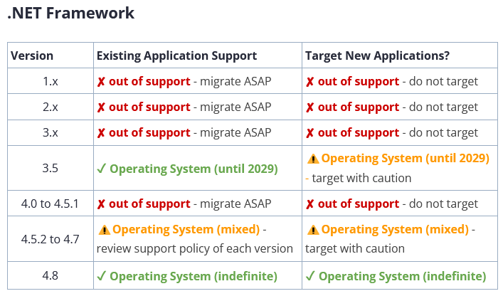
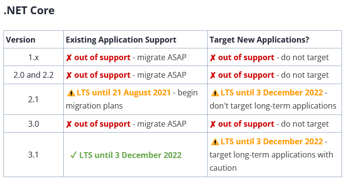
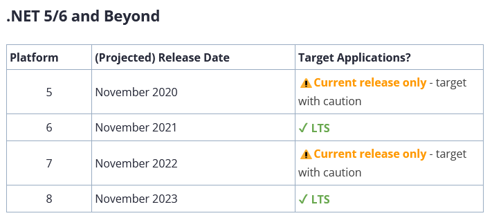

Every new commit follows the tutorial playlist order.

# EmployeeManagement

Tutorial playlist, kudvenkat: https://www.youtube.com/playlist?list=PL6n9fhu94yhVkdrusLaQsfERmL_Jh4XmU

## Goals
 
- Implement the solution over:
  - .NET Core 2.1 - LTS
  - .NET Core 2.2 - Out of Support, https://github.com/aspnet/Mvc/tree/release/2.2
  - .NET Core 3.1 - LTS
  - .NET Core 5 - Out of Support
  - .NET Core 6 - LTS
  - .NET Core 7 - Current
  - .NET Core 8 - LTS, release on November 2023
  - .NET Framework 4.7.2 - Maybe LTS

## Lifecycle Explained

# TODO

- [ ] Publish an ASP.NET Core app to IIS: https://learn.microsoft.com/en-us/aspnet/core/tutorials/publish-to-iis?view=aspnetcore-7.0&tabs=visual-studio
- [ ] IIS publishing: https://docs.appeon.com/ps2021/Inprocess_hosting_vs_outofprocess_hosting.html
- [ ] Migration: https://learn.microsoft.com/en-us/aspnet/core/migration/mvc?view=aspnetcore-6.0